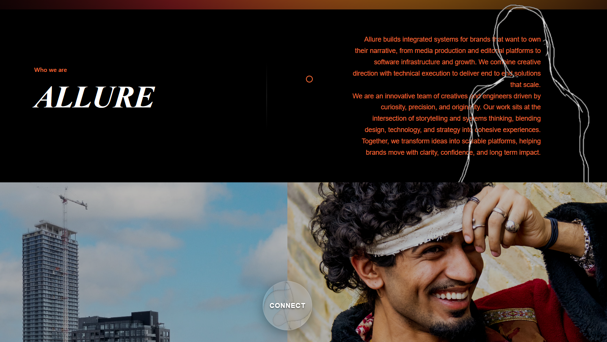
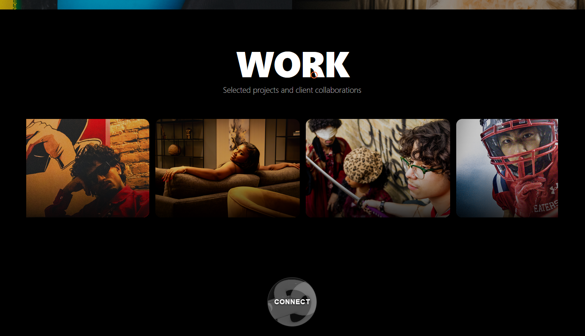
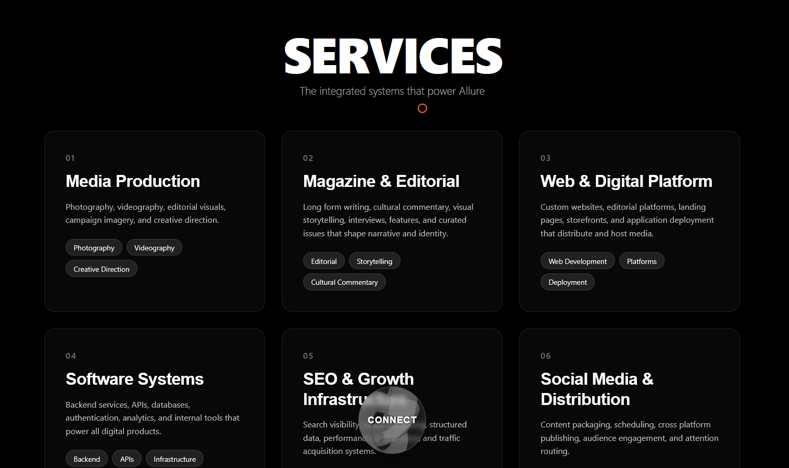
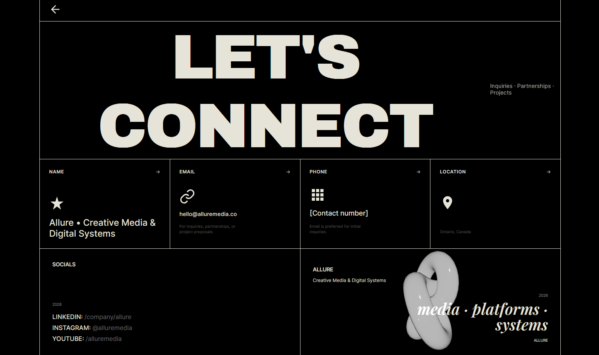

  
  
  
  

Allure Creative Media and Digital Systems is a digital branding and systems development project focused on building modern scalable infrastructure for creative businesses. The project combines visual storytelling with technical execution delivering not just design but structured digital systems that support long term growth.

I designed and developed a cohesive brand presence alongside the underlying digital architecture including responsive web interfaces content systems and workflow automation tools. The goal was to bridge creativity and engineering by transforming brand identity into a functional performance driven digital ecosystem.

Allure Creative Media and Digital Systems demonstrates my ability to merge creative direction with technical systems thinking building platforms that are visually compelling operationally efficient and strategically scalable.

Technologies Used:

    TypeScript
    JavaScript
    HTML
    CSS
    GLSL
    SCSS

Source: <a href="https://inongoy.github.io/Allure/">Allure</a>