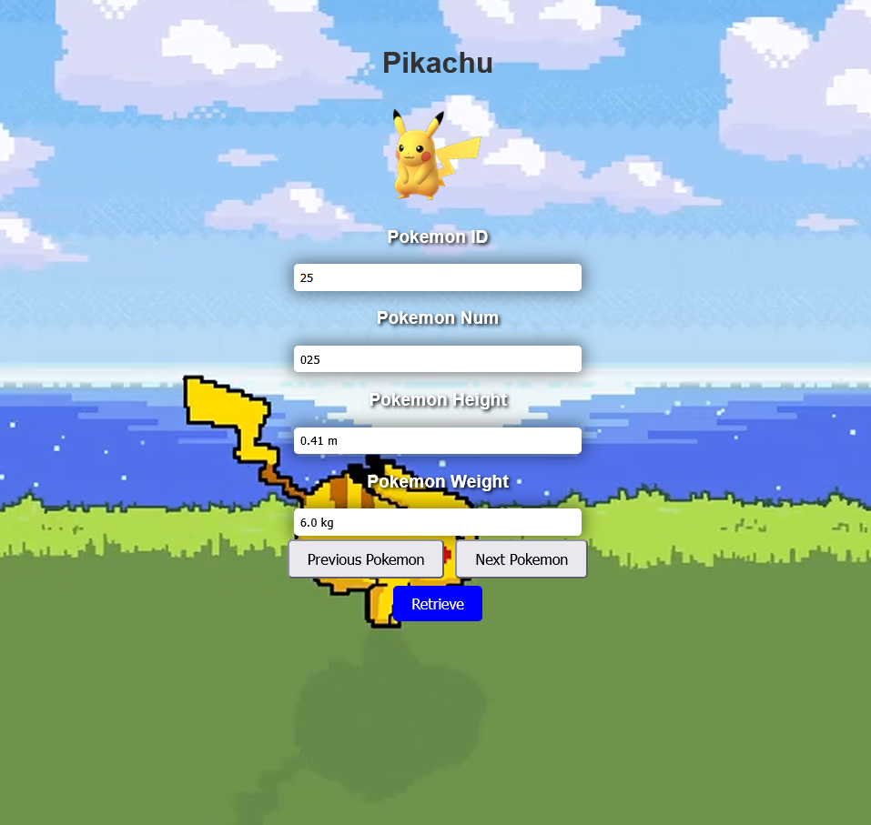
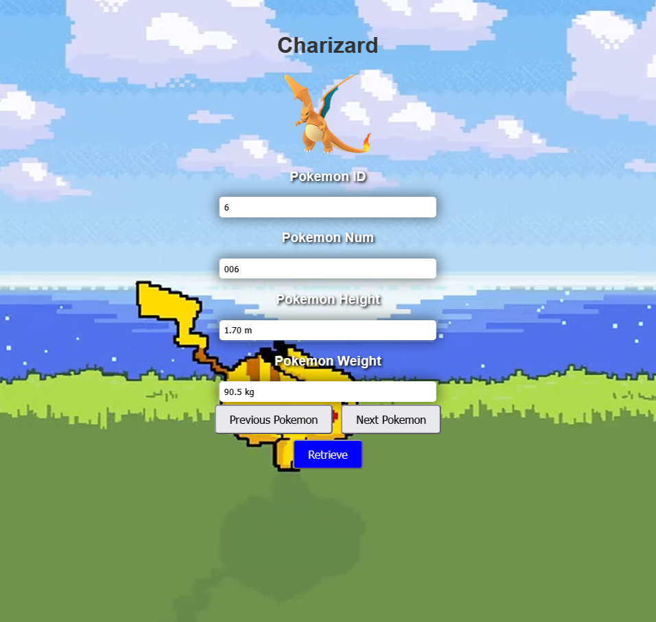
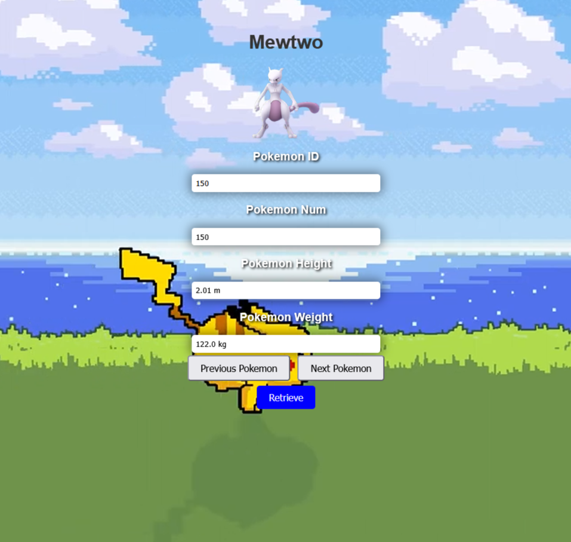

<div class="text-center p-4">
  
  
  
</div>

Pokedex is a lightweight web application that displays Pokémon information by loading a structured JSON dataset and rendering it dynamically in the browser. Instead of relying on a traditional API, the app fetches a JSON file and parses the Pokémon array, then updates the interface in real time as users browse through entries. The project demonstrates core frontend skills such as asynchronous data loading, DOM manipulation, and state management using a current index to navigate through a large dataset.

The application supports browsing with next and previous controls, direct lookup using an ID based search, and dynamic rendering of key Pokémon attributes including the image, name, number, height, and weight. Once the dataset is loaded, navigation is smooth and efficient because Pokémon details are pulled directly from memory rather than reloading data every time.

This project highlights the ability to build interactive web interfaces using plain JavaScript, handle asynchronous JSON loading with XMLHttpRequest, and structure UI logic around reusable display functions. It also demonstrates practical experience working with real datasets, validating user input, and managing application state cleanly.

If you want, I can also write a shorter one sentence version for a project card, plus a README section that explains how to run it and what features it includes.

<hr>

Here is a snippet of code:

```cpp
<script>
        let pokemonData = null;
        let currentPokemonIndex = 0;

        function getJSONAsync(url) {
            const request = new XMLHttpRequest();

            request.onload = function () {
                if (request.status === 200) {
                    pokemonData = JSON.parse(request.responseText)['pokemon'];
                    displayPokemonDataByIndex(currentPokemonIndex);
                }
            };

            request.open("GET", url, true);
            request.send();
        }

        function displayPokemonDataByIndex(index) {
            if (pokemonData && pokemonData[index]) {
                const pokemon = pokemonData[index];
                displayPokemonByObj(pokemon);
            }
        }

        function displayPokemonByObj(pokemon) {
            document.getElementById("pokemonImage").src = pokemon['img'];

            document.getElementById("pokemonId").value = pokemon['id'];
            document.getElementById("pokemonNum").value = pokemon['num'];
            document.getElementById("pokemonName").innerText = pokemon['name'];
            document.getElementById("pokemonHeight").value = pokemon['height'];
            document.getElementById("pokemonWeight").value = pokemon['weight'];
        }

        function getDataAsync() {
            const tempURL = "https://raw.githubusercontent.com/Biuni/PokemonGO-Pokedex/master/pokedex.json";
            getJSONAsync(tempURL);
        }

        function nextPokemon() {
            if (currentPokemonIndex < pokemonData.length - 1) {
                currentPokemonIndex++;
                displayPokemonDataByIndex(currentPokemonIndex);
            }
        }

        function previousPokemon() {
            if (currentPokemonIndex > 0) {
                currentPokemonIndex--;
                displayPokemonDataByIndex(currentPokemonIndex);
            }
        }

        function search() {
            let currentNumber = document.getElementById("pokemonId").value;
            if(isNaN(currentNumber)) return;

            currentNumber = parseInt(currentNumber);

            const pokemon = pokemonData.find(x => x.id === currentNumber);
            if(!pokemon) return;

            displayPokemonByObj(pokemon);
            currentPokemonIndex = pokemon.id - 1;
        }

        getDataAsync();
        const video = document.getElementById("myVideo");
    </script>
```

<hr>

Here is the deployed applicatio [Pokedex](https://inongoy.github.io/Pokedex/)