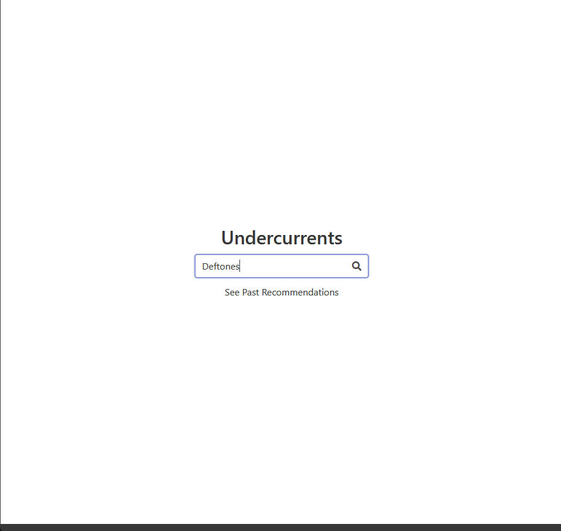
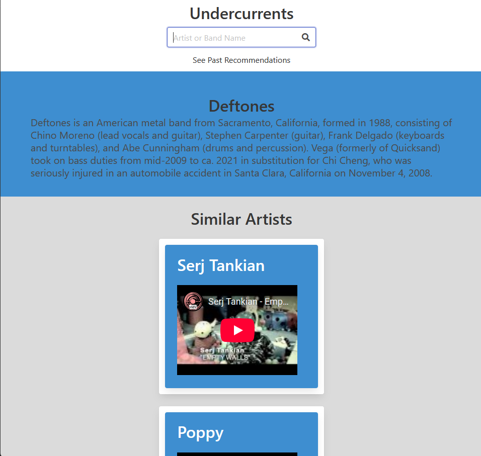
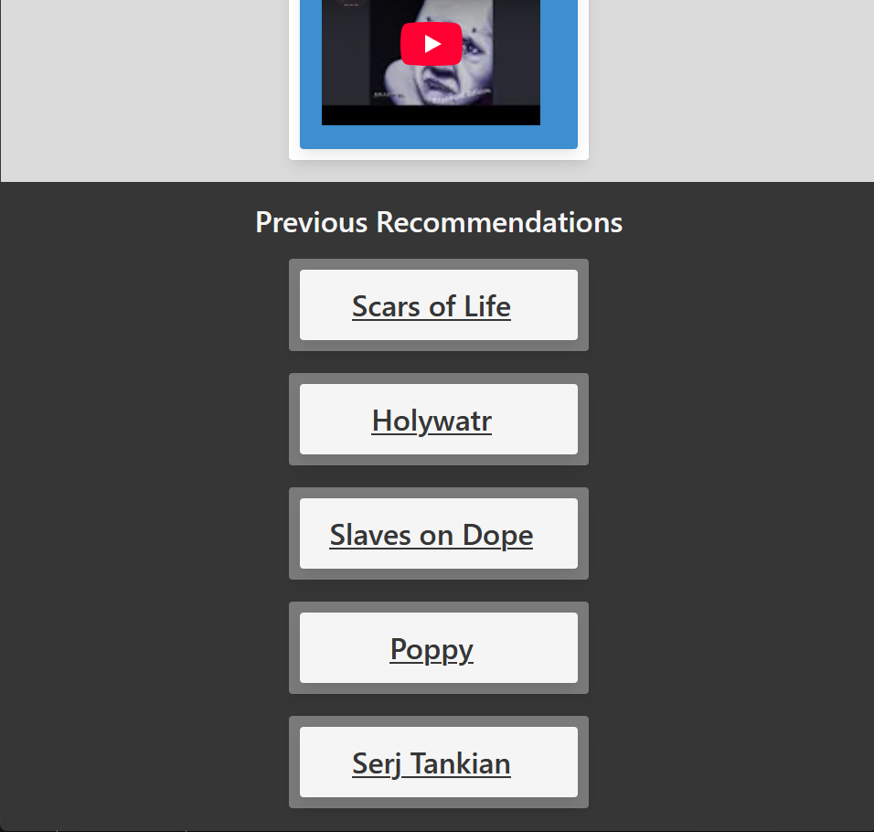

  
  
  

Find artists similar to the ones you already love and give them a listen and a helping hand. Bulma CSS is being used to style the webpage. We're currently utilizing the Last.fm and YouTube API to deliver artists of a similar genre. Last FM API is used to find a user specified artisit, their bio and other similar artists. Using that information YouTube API is being used to acquire music videos of the similar artist. The application uses jQuery to update the html on the page. It uses JavaScript fetch method to connect and retrieve the necessary data from the APIs. The application has several error checking functionalities built into it as given below.

    When a blank name is submitted by the user.
    When a user specified artist name is not found in the LastFM database.
    When there is an error connecting to the LastFM API.
    When there is an error connecting to the YouTube API.
 
Source: <a href="https://github.com/Inongoy/undercurrents">Undercurrents</a>
